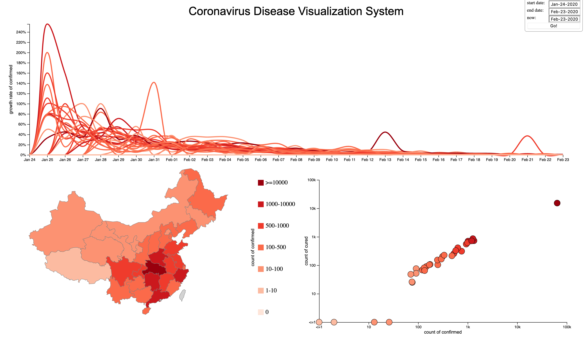
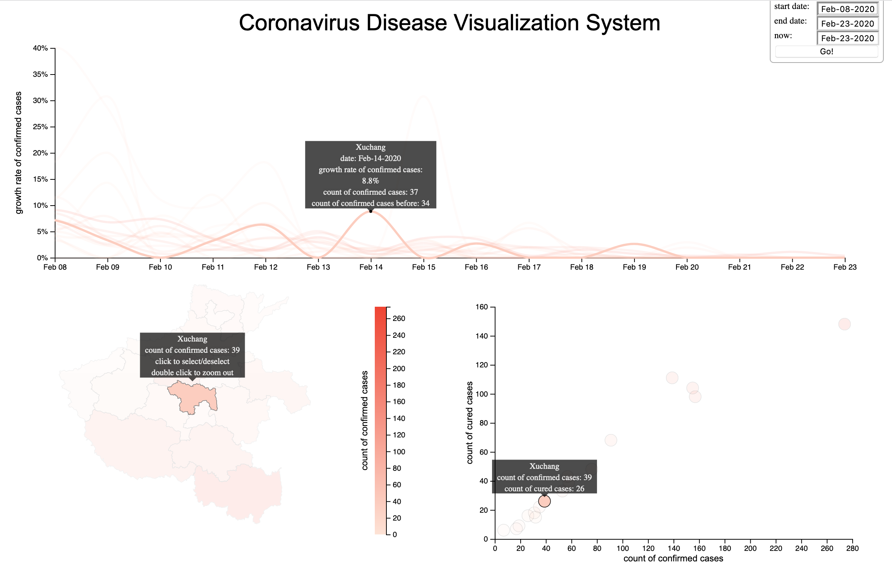

# COVID-19 Disease Visualization System
```

```
## Overview

The recent breakout of the Coronavirus disease in Wuhan, China is definitely shattering news for all. It spread out so quickly that within a few days almost every place in China was deeply affected. To better understand the spreading process, I created this visualization system. The data comes from [https://github.com/BlankerL/DXY-COVID-19-Data](https://github.com/BlankerL/DXY-COVID-19-Data), which further comes from [DXY](https://ncov.dxy.cn/ncovh5/view/pneumonia).
## How to Use
For now, I haven't deployed it on GitHub Pages, so you'd have to first download it to your computer and open index.html with your browser.

Probably, you need to first configure your browser before seeing anything because most of current browsers block loading data locally with a XMLHttpRequest. Here is how to configure it with Firefox:

1. Open the **about:config** URL in your browser. Click the "Accept the Risk and Continue" button.
2. In the search pane, type in **privacy.file_unique_origin**. By default, it should say **true** in the row for the item.
3. Click the button on the right side of the row; **true** should have turned into **false**.
4. Try refreshing your page. This system should now load properly.

There are some security implications to this change if you often find yourself opening HTML files locally. If they concern you, you should toggle the setting back to its default after playing with this system. [ More details can be found here and in the corresponding CVE](https://developer.mozilla.org/en-US/docs/Web/HTTP/CORS/Errors/CORSRequestNotHttp).

## Design Motivation
*Map* is the ideal choice to manifest the geographical distribution pattern. Also, it naturally serves as an interaction interface where the user can filter some regions by clicking on the map. Thereby I made the system clean by saving unnecessary ”buttons” or ”lists” for filtering or detailed viewing operations.

The scatterplot is good at showing the relationship between count of confirmed cases and count of cured cases. The scatterplot on the log scale strongly suggests that there is a linear relationship between the two variables, which could be pursued further for a mathematical model.

To smooth the spreading process and keep a consistent mental map for the user, I changed the line chart into a ”curve chart” where the points are strung together by a curve. This is especially effective when *animation* is activated. The user can clearly see what’s happening during a period of time and quickly spot those cities which had a surge of confirmed cases at some time. To make my system clean, I did not label with names the regions on the map, points on the scatterplot or curves on the curve chart because clustered text would interfere with the flow of elements, but it comes at a cost that the user cannot immediately know which is which. To remedy this flaw, I created a mouseover interaction. When the mouse hovers over one entity, no matter on which chart, all corresponding entities get hightlighted and are attached with tooltips containing detailed information.
```

```
## Limitations and To-do List
1. Although I tried very hard to separate those curves by enabling the user to filter, change time period and do mouseover, to some extent, those curves still intermingle with each other. Also, when a city was initially affected, doubling the confirmed cases from two to four did not really mean severity – it’s just randomness involved when the size was small. Yet these surges at startup time unnecessarily enlarged my y-axis scale, making it difficult to separate curves at later time. However, this is not a big problem here because the user can explicitly change the time period to exclude startup-time surges. However, I am thinking about how to remedy this flaw or even more radically, **get rid of the curve chart and use some new, innovative visua metaphor**.
2. Deploy it on GitHub Pages.
3. Let the script automatically fetch updated data. No need to manually run Python.
4. The data of some cities are not really *unavailable*, it is just that I haven't map exactly all the Chinese names to English. In short it is just a *name mismatch bug*.
5. The China map is not accurate. I am thinking about changing it later. If you have good *geojson* data source, please let me know.